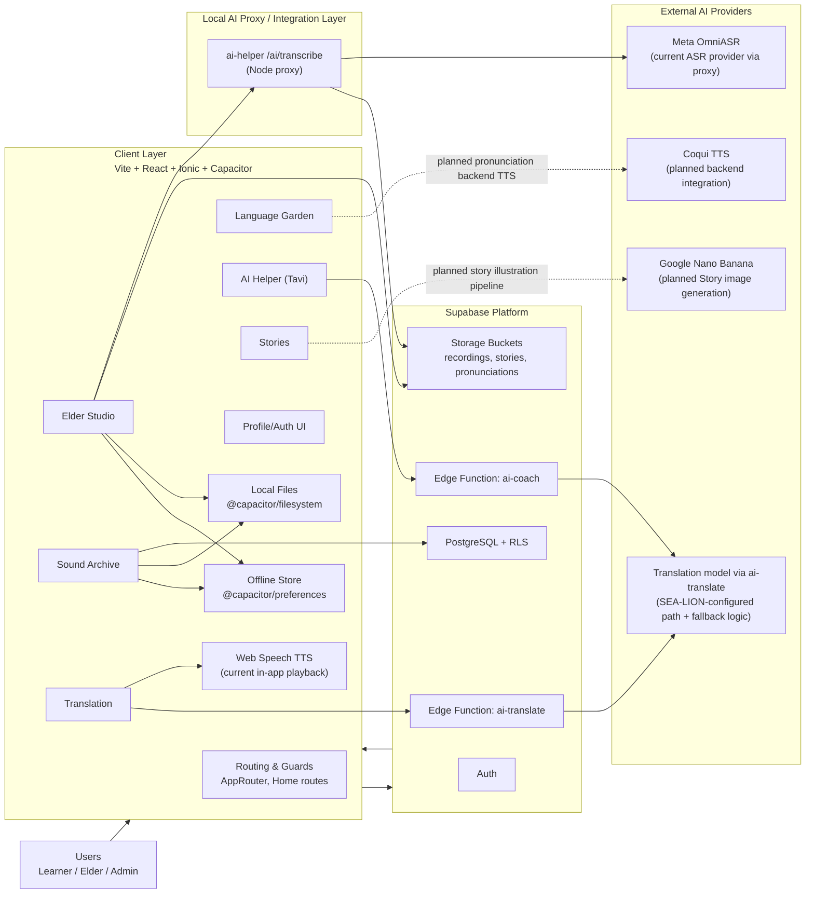

# TALEKA — Tech Stack Architecture (As-Implemented + Document-Aligned)

_Last updated: March 2026_

## 1) Architecture Summary

TALEKA uses a **mobile-first hybrid architecture**:

- **Client App**: `Vite 5 + React 18 + Ionic React 8 + Capacitor 8`
- **Core Backend**: `Supabase` (Auth, PostgreSQL, Storage, Edge Functions)
- **AI Layer**: Whisper (ASR), SEA-LION (translation), Coqui (TTS), Nano Banana (image generation)
- **Offline Strategy**: `@capacitor/preferences` queue + `@capacitor/filesystem` for binary audio files

> Source of truth priority used: **`src/` implementation first**, then `docs/final/TUYANG_TASK_BREAKDOWN.md` and `docs/final/DOCUMENTATION_CORRECTIONS.md`.

---

## 2) Layered Tech Stack

| Layer | Tech | Responsibility | Evidence |
|---|---|---|---|
| Presentation/UI | Ionic React 8, React 18, Tailwind CSS | Pages, components, navigation shell, responsive interactions | `src/pages/*`, `src/components/*`, `package.json` |
| App Runtime | Vite 5, TypeScript 5 | Build/dev pipeline, static typing, module bundling | `package.json`, `tsconfig*.json`, `vite.config.ts` |
| Mobile Bridge | Capacitor 8 (`android`, `ios`) | Native packaging + native capabilities bridge | `capacitor.config.ts`, `android/`, `package.json` |
| State Management | Zustand 5 | Auth/session and app state coordination | `src/stores/*`, `package.json` |
| Routing | React Router v6 | Route guarding and in-app module flow | `src/navigation/AppRouter.tsx`, `src/pages/HomePage.tsx` |
| Data/Auth Backend | Supabase Auth + PostgreSQL + RLS | User auth, profile sync, domain persistence | `src/lib/auth.ts`, `src/lib/supabase.ts`, `supabase/` |
| Object Storage | Supabase Storage buckets | Audio/story assets (`recordings`, `stories`, `pronunciations`) | `src/lib/elderStudio.ts`, docs correction notes |
| Serverless API | Supabase Edge Functions + local `ai-helper` | Translation and AI endpoints orchestration | `src/lib/translate.ts`, `ai-helper/server.js` |
| Offline Persistence | `@capacitor/preferences` | Key-value metadata, pending sync queue | `src/lib/storage.ts`, `src/lib/elderStudio.ts` |
| Binary Local Files | `@capacitor/filesystem` | Local recording files and playback source handling | `src/lib/elderStudio.ts` |
| Quality Tooling | ESLint, Prettier, Vitest, Testing Library, Husky | Linting, formatting, tests, precommit checks | `package.json`, `AGENTS.md` |

---

## 3) Module-to-Stack Mapping

| Module | Frontend Entry | Core Service Layer | Backend/AI Dependencies |
|---|---|---|---|
| Authentication | `AuthPage`, `ResetPasswordPage` | `src/lib/auth.ts` | Supabase Auth + profiles table |
| Home Shell & Navigation | `HomePage`, `AppRouter` | route guards + role resolution | Session from Supabase |
| Elder Studio | `ElderStudioTab` | `src/lib/elderStudio.ts` | Preferences queue, Filesystem, Supabase Storage, `/ai/transcribe` |
| Sound Archive | `SoundArchiveTab`, `ArchiveReviewPage` | archive/sync/review helpers | Supabase recordings + sync retry |
| Language Garden | `LanguageGardenTab`, `QuizGame`, `VocabMaster`, `WordleGame`, `LevelUpPage` | vocab/quiz/progress libs | Local progress + optional AI grounding |
| AI Helper (Tavi) | `AiHelperPage` | `src/lib/aiCoach.ts` | `ai-translate` edge fn + context memory |
| Translation | `TranslatePage` | `src/lib/translate.ts` | Supabase Edge Function `ai-translate` |
| Story Experience | `StoryPage`, `StoryDetailPage`, `StoryReadPage` | `src/lib/storyData.ts` | Current UI/data local; doc target includes Nano Banana pipeline |
| Profile | `ProfilePage` | profile/auth helpers | Supabase profile + sign-out/session guard |

---

## 4) AI Architecture (Corrected Assignments)

| Capability | Provider | Current Status in `src` | Notes |
|---|---|---|---|
| ASR (Speech-to-Text) | OpenAI Whisper API | Implemented via `VITE_AI_BASE_URL/ai/transcribe` in studio flow | Used in Elder Studio transcription |
| Translation | SEA-LION via edge function | Implemented via `supabase.functions.invoke('ai-translate')` | Used in Translation page + AI coach |
| TTS | Coqui TTS | Planned/documented as TTS provider; not clearly wired as direct `ai-tts` call in current `src` | Correction docs enforce Coqui for TTS |
| Image Generation | Google Nano Banana | Documented for Story Archive; no direct call evident in current story UI pages | Must stay image-only (not TTS) |

**Important correction (from docs):**
- ✅ `TTS = Coqui TTS`
- ✅ `Image generation = Nano Banana`
- ❌ Nano Banana is **not** a TTS engine

---

## 5) Offline-First Sync Design

| Concern | Implemented Pattern |
|---|---|
| Local metadata persistence | `@capacitor/preferences` JSON storage |
| Local binary recording storage | `@capacitor/filesystem` |
| Sync queue | Pending recording IDs in queue key (`PENDING_SYNC`) |
| Sync lifecycle states | `local_only → syncing → synced / sync_failed` |
| Recovery | Retry failed sync and transcription retry paths |
| Online/offline sensing | `window` online/offline events in archive flow |

---

## 6) Deployment & Runtime Topology

| Environment | Runtime |
|---|---|
| Web | Vite build, browser runtime |
| Mobile iOS/Android | Capacitor app shells (`cap sync`, native IDE) |
| Backend | Supabase cloud (Auth, DB, Storage, Functions) |
| Optional local AI gateway | `npm run ai-helper:dev` (`ai-helper/server.js`) |

---

## 7) Architecture Diagram (Mermaid, As-Implemented)

---

## 8) Notes: As-Implemented vs Planned

- **Implemented strongly now**: Auth, routing shell, Elder Studio offline sync mechanics, Sound Archive, translation edge-function integration, AI helper conversation flow.
- **Documented/planned extensions**: full Coqui TTS API wiring and Nano Banana Story Archive generation pipeline.
- **Documentation consistency rule**: keep provider mapping from `DOCUMENTATION_CORRECTIONS.md` as the official AI assignment baseline.
